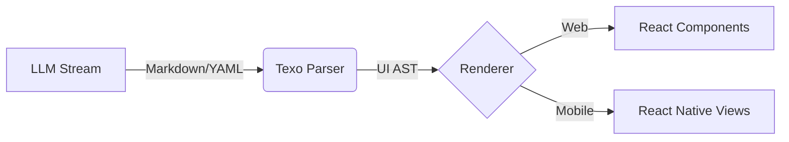

# Texo

> **Weave Text into UI.**
> A stream-oriented Generatable UI framework for the LLM era.

[](https://opensource.org/licenses/MIT)

## Concept

**Texo** (Latin for *weave, construct*) is a framework designed to bridge the gap between **LLM Streaming Text** and **Native UI Components**.

Unlike Vercel's `v0` or standard generative UI tools that rely on brittle JSON or raw HTML generation, Texo uses a robust, human-readable syntax (**Markdown Directives + YAML**) to "weave" UI components in real-time.

It is platform-agnostic, supporting both **React (Web)** and **React Native (Mobile)**.

## Why Texo?

- **Stream-First:** Renders UI incrementally as the LLM types, without waiting for a complete JSON object.
- **Fault Tolerant:** If the syntax breaks, it gracefully degrades to text/code blocks. No white screens.
- **Platform Agnostic:** Write the parser once (`@texo/core`), render anywhere (`@texo/react`, `@texo/native`).
- **Developer Control:** You define the components; the LLM just invokes them.

## Architecture

Texo transforms a stream of text into a Virtual UI Tree (AST) and reconciles it with your component registry.



## Usage Preview

### 1. The Protocol (LLM Output)
The LLM generates standard Markdown mixed with **UI Directives**:

```markdown
Here is the analysis of your server costs:

::: stats-card
title: "Monthly Cost"
value: "$1,240"
trend: "up"
:::

And the details:

::: data-table
columns: ["Service", "Cost"]
data:
  - ["EC2", 800]
  - ["RDS", 440]
:::
```

### 2. The Implementation (React)

```jsx
import { TexoRenderer } from '@texo/react';
import { StatsCard, DataTable } from './design-system';

const registry = {
  'stats-card': StatsCard,
  'data-table': DataTable,
};

function ChatInterface({ stream }) {
  return (
    <TexoRenderer 
      content={stream} 
      registry={registry} 
      fallback={MarkdownView} 
    />
  );
}
```

## Directory Structure

```text
texo/
├── packages/
│   ├── core/           # @texo/core (Parser & AST)
│   ├── react/          # @texo/react (Web Renderer)
│   └── native/         # @texo/native (React Native Renderer)
├── examples/           # Demo Projects
├── package.json        # Monorepo Root
└── README.md
```

## 🛠 Roadmap

- [ ] **@texo/core**: Streaming Markdown/YAML parser implementation.
- [ ] **@texo/react**: React reconciler and hooks.
- [ ] **@texo/native**: React Native adapter.
- [ ] **Schema Generator**: Auto-generate system prompts for LLMs based on component props.

## License

MIT © Texo Authors
